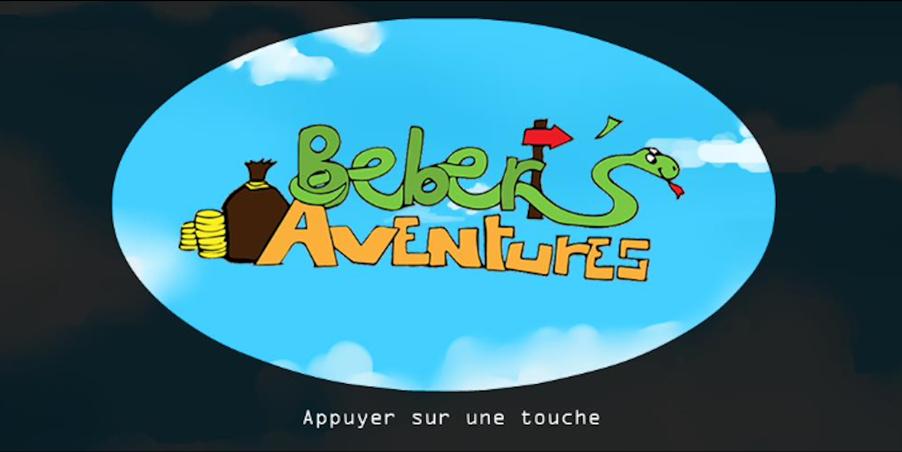
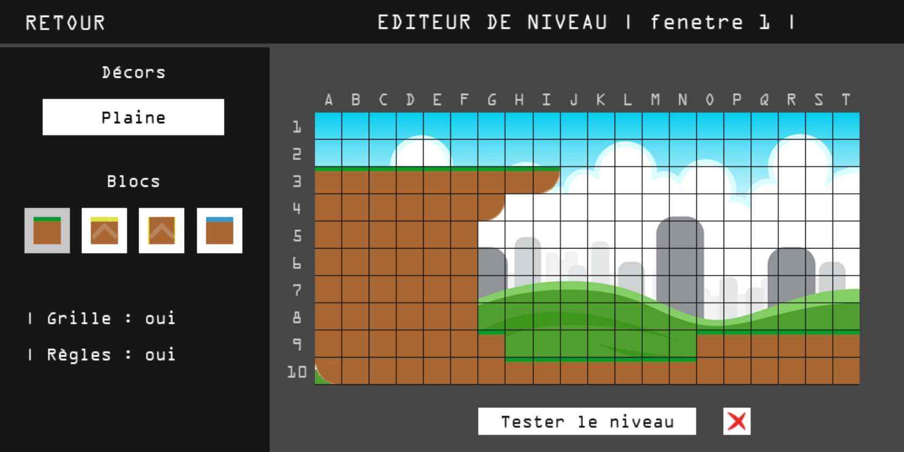

# The Bebert's Adventures

Bebert's Adventures is a Python application developed with Pygame. It was developed in 2017 with [Raphael Gimenez](https://github.com/RaphaelGimenez).


## Description

The Bebert's Adventures is an exciting platformer video game inspired by the classic Mario Bros. In this game, players take control of a charismatic frog named Bebert as he embarks on a thrilling journey through various challenging levels.

Test your platforming skills as you guide Bebert through vibrant worlds. Traverse treacherous terrain, leap across platforms, and overcome various obstacles in your quest for progress. Each level presents a progressively challenging experience, pushing your abilities to the limit.

The Bebert's Adventures also offers a unique feature that sets it apart. The game includes a level editor, allowing players to unleash their creativity and design their own custom levels. Build intricate environments, craft challenging platforming sections, and shape the game world according to your imagination. Share your creations with other players and expand the game's replayability.

Immerse yourself in the nostalgic atmosphere of Bebert's Adventures with its retro-inspired soundtrack, creating an engaging and immersive experience.

Get ready to embark on an unforgettable platforming journey with Bebert. Push your skills to the limit, explore imaginative levels, and create your own challenges. Jump into Bebert's Adventures and experience the joy of classic platforming with a modern twist.

## Screenshots






## Installation

1. Make sure you have Python installed (version 3 or higher) by running the following command in your terminal:

```
python3 --version
```

2. Clone this GitHub repository

3. Install the necessary dependencies by running the following command in your terminal:

```
pip install -r requirements.txt
```

4. Launch the application :

```
python3 main.py
```
